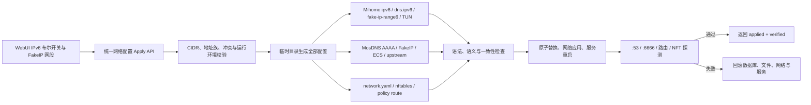

# MSF IPv6、FakeIPv6 与 MosDNS 完善计划

> 状态：`DEFERRED`，独立保存，暂不进入 Liquid Glass V1 实施范围
> 计划日期：2026-08-02
> 适用范围：MSF generated 配置、Mihomo、MosDNS、Linux nftables、TUN、Docker host-tun 与 WebUI 设置
> 关联计划：[`liquid-glass-ui-redesign-plan.md`](./liquid-glass-ui-redesign-plan.md)

## 1. 决策与实施边界

这是一份延后执行的功能完整化计划，不阻塞第一版 Liquid Glass UI 重制。UI V1 可以先完成视觉与组件迁移，但不得把当前 IPv6/MosDNS 的部分实现包装成“已完整生效”。

本计划确认以下产品决策：

1. WebUI 中的“启用 IPv6”继续是一个明确的布尔开关，不改成三态。
2. 该开关直接绑定：
   - 数据库 `enable_ipv6`
   - Mihomo 顶层 `ipv6`
   - Mihomo `dns.ipv6`
   - IPv6 FakeIP 是否激活
   - IPv6 nftables、TUN route 与 policy route 数据面
3. 自定义 `fake_ip_range_v6` 在 IPv6 关闭时仍保留为预配置值，但不进入运行数据面。
4. MosDNS 的“阻止 AAAA”是独立 DNS 策略开关，不替代 IPv6 主开关，也不与其合并为一个三态控件。
5. 页面必须同时展示 configured、effective、applied 与 verified 状态，不能只显示“保存成功”。

## 2. 当前状态与已确认问题

当前实现属于“局部存在、端到端断链”。

### 2.1 已具备的基础

- 数据库与 API 已保存 `enable_ipv6`、`fake_ip_range_v6`。
- MosDNS 已存在 AAAA 分支，并能向 Mihomo `:6666` 请求 FakeIP。
- `network.yaml`、NFT set、TUN `route-address` 和 Docker host-tun 已有部分 IPv6 支持。
- 初始化向导与系统设置页已有 IPv6 开关和 FakeIP 网段概念。

### 2.2 已确认缺陷

| 等级 | 问题 | 影响 |
|---|---|---|
| P0 | Mihomo 模板存在 `fake-ip-range6`，生成器却不替换自定义值；fallback 也缺少该字段 | FakeIP 生产端与 MosDNS/NFT/TUN 使用不同网段 |
| P0 | 设置页提交遗漏 v4/v6 FakeIP range，后端会把缺失值恢复为默认值 | 保存其他设置时可能静默重置自定义网段 |
| P0 | `enable_ipv6=false` 时仍生成或安装 IPv6 NFT 与 policy route | 已关闭的 IPv6 流量仍可能被透明接管 |
| P1 | MosDNS ECS 输入与运行 YAML 脱节 | 页面值与实际 ECS 不一致 |
| P1 | MosDNS upstream overrides 只保存 JSON，不确定性渲染到运行 YAML | 页面提示成功但上游不变 |
| P1 | structured settings 只写数据库，不执行生成、网络应用或重启 | 再次形成假保存路径 |
| P1 | custom Mihomo 模式下 MosDNS/network 可更新而 Mihomo 不更新 | 数据面静默错配 |
| P1 | CIDR 校验不检查地址族、前缀与冲突 | 错误值可能直到服务启动或 NFT 加载时才失败 |
| P1 | IPv6 主开关与 MosDNS AAAA 策略缺少组合说明 | 可能出现真实 AAAA 直连绕过代理，用户却不知情 |
| P2 | IPv4/IPv6 优先级使用两个开关，可进入无效双开状态 | UI 状态与 MosDNS 模板实际行为不一致 |
| P2 | 服务重启、网络应用和热更新错误被弱化或忽略 | “已保存”不能证明“已生效” |

关键代码位置：

- `internal/server/mssb_templates/mihomo/config.yaml`
- `internal/server/configgen.go`
- `internal/server/handlers_setup.go`
- `internal/server/handlers_settings_structured.go`
- `internal/server/handlers_system.go`
- `internal/server/handlers_mosdns.go`
- `internal/server/proxy_mode_consistency.go`
- `web/src/app/settings/SettingsClient.tsx`
- `web/src/pages/SetupPage.tsx`
- `web/src/app/mosdns/system/page.tsx`
- `web/src/components/mosdns/ResolutionPolicySection.tsx`

### 2.3 119 运行态基线

前次只读检查观察到：

- 数据库 `enable_ipv6=false`。
- Mihomo 顶层 `ipv6=false`，`dns.ipv6=false`。
- Mihomo 仍保留默认 `fake-ip-range6: f2b0::/18`。
- `network.yaml` 显示 IPv6 disabled，但 nftables 仍存在 IPv6 FakeIP/capture 规则。
- IPv6 policy route 仍存在。
- MosDNS `:53` 仍可返回 AAAA。
- Mihomo DNS `:6666` 的 AAAA 为空。

该基线证明 UI、DNS 策略、FakeIP 生产端与网络接管端尚未处于同一个有效状态。执行本计划前必须重新采样，不能假定旧状态未变化。

## 3. 权威状态模型

### 3.1 IPv6 主开关

| UI 主开关 | Mihomo `ipv6` | Mihomo `dns.ipv6` | FakeIPv6 | IPv6 NFT/TUN/policy route |
|---|---:|---:|---|---|
| 关闭 | false | false | 保留网段配置但不激活 | 不生成、不安装；已有托管规则必须卸载 |
| 开启 | true | true | 使用规范化后的自定义网段 | 生成、安装并完成运行态探测 |

必须满足以下不变量：

- WebUI 开关、数据库、Mihomo 与网络数据面不得出现不同值。
- 关闭 IPv6 后，MSF 不再生成 IPv6 FakeIP，也不再接管 IPv6 FakeIP 流量。
- 重新开启后，使用用户最后保存的 `fake_ip_range_v6`，不能静默恢复默认值。

### 3.2 MosDNS AAAA 策略

MosDNS“阻止 AAAA”保持独立布尔开关，其组合行为明确如下：

| IPv6 主开关 | 阻止 AAAA | 期望行为 |
|---|---|---|
| 关闭 | 关闭 | MosDNS 可返回真实 AAAA，但这些流量不会进入 Mihomo IPv6 数据面；UI 必须警告可能直连绕过代理 |
| 关闭 | 开启 | MosDNS 对 AAAA 返回 NOERROR/NODATA；IPv6 数据面仍保持卸载 |
| 开启 | 关闭 | 代理域名可返回 IPv6 FakeIP，直连域名按规则返回真实 AAAA |
| 开启 | 开启 | Mihomo 具备 IPv6 能力，但客户端不获得 AAAA；UI 明确显示 DNS 策略限制 |

不得根据其中一个开关悄悄改写另一个开关的保存值。

作用域约束：

- “阻止 AAAA”只约束客户端主入口 `:53` 以及由该客户端请求触发的 requery。
- Mihomo nameserver、节点域名解析和其他内部专用 DNS 入口不受该开关约束，除非另有明确配置。
- 当 `enable_ipv6=false` 且“阻止 AAAA”关闭时，客户端入口的所有 AAAA 查询必须绕过 FakeIP classifier、FakeIP cache、`$cnfake/$nocnfake` 和 Mihomo FakeIP 上游，统一进入真实 IP 上游流程；不能依赖 `dns.ipv6=false` 后的空响应自动 fallback。

### 3.3 协议优先级

“IPv4 优先”和“IPv6 优先”从两个独立开关改为一个单选值：

- 自动
- IPv4 优先
- IPv6 优先

该单选只表达 DNS 结果排序，不代表 IPv6 主开关，也不能替代主开关。

## 4. 目标配置链路

## 5. 阶段 A：配置契约与校验

### A1. 统一 CIDR 规范化

新增单一 FakeIP prefix 规范化模块，供 API 与所有生成器复用：

- v4 字段只能接受 IPv4 CIDR。
- v6 字段只能接受 IPv6 CIDR。
- 统一转换成 masked canonical CIDR。
- 检查前缀长度是否能满足 FakeIP 池与路由需求。
- 拒绝链路本地、组播、未指定地址、回环和明显不可用范围。
- 检查与 LAN、本地 bypass、DNS 地址集合和另一 FakeIP 池的冲突。
- 校验失败返回 HTTP 400，数据库、配置与服务都不得变化。

### A2. 修复更新语义

- `/api/v1/setup/config` 改为真正的 PATCH 语义，或要求带版本号的完整 PUT。
- 请求中未出现的字段必须保留当前值，禁止调用 defaults 后覆盖。
- `SettingsClient` 与 Setup 的状态模型必须包含 v4/v6 FakeIP range。
- `/settings/structured` 遇到网络字段时复用同一 Apply pipeline；不能只写数据库。
- 并发配置 mutation 串行化，并使用版本号或 ETag 防止旧页面覆盖新配置。

### A3. API 返回模型

至少返回：

- `apply_id`
- `normalized_config`
- `changed_fields`
- `saved`
- `generated`
- `network_applied`
- `services_restarted`
- `probes_passed`
- `rolled_back`
- 每个阶段的错误、耗时与可恢复建议

### A4. 退出条件

- partial save 不改变 FakeIP 网段。
- v4/v6 地址族填反稳定返回 400。
- 非 masked 输入保存后返回 canonical CIDR。
- 无效请求不会留下数据库或文件改动。

## 6. 阶段 B：Mihomo、MosDNS 与网络生成完整化

### B1. Mihomo

- generated template 正确渲染 `dns.fake-ip-range6`。
- fallback 配置补充并渲染 `fake-ip-range6`。
- 同步检查顶层 `ipv6`、`dns.ipv6`、FakeIPv6 与 TUN `route-address`。
- IPv6 关闭时不得把 v6 FakeIP prefix 加入 TUN 路由。
- 生成后调用 Mihomo 配置检查能力，不只验证 YAML 语法。

### B2. MosDNS

- 主配置的 IPv6 FakeIP classifier 使用统一规范化值。
- 为 `enable_ipv6=false && block_aaaa=false` 建立显式 real-AAAA 路径：客户端 `:53` 的 AAAA 请求绕过 FakeIP classifier/cache、`$cnfake/$nocnfake` 与 `:1053/:6666`，直接进入真实 IP 上游和既有 real-IP 判定流程。
- 为 `block_aaaa=true` 建立仅作用于客户端主入口及其 requery 的明确 gate，不影响 Mihomo 节点解析等内部入口。
- `nft/fixip.txt` 等辅助文件移除硬编码 `f2b0::/18`。
- ECS IP 确定性渲染到 `forward_nocn_ecs.yaml`。
- upstream overrides 确定性渲染到实际运行文件，包括：
  - `forward_local.yaml`
  - `forward_nocn.yaml`
  - `forward_nocn_ecs.yaml`
  - `forward_1.yaml`
- 重启前在隔离目录验证所有 include 与插件参数。

### B3. network.yaml、NFT 与 policy route

IPv6 关闭时：

- `network.yaml.ipv6.enable=false`。
- 不生成有效 IPv6 FakeIP capture 规则。
- 清理 MSF 托管的 ip6 redirect/TProxy 规则与 set。
- 不安装 `ip -6` fwmark rule 或 table 100 local route。
- TUN 与 Docker host-tun 不添加 v6 FakeIP route，并精确删除旧快照中的受管 v6 FakeIP route。

IPv6 开启时：

- NFT set、TUN route、Docker route 与 Mihomo/MosDNS 使用同一前缀。
- 若 prefix 发生变化，先根据旧配置快照精确删除旧 prefix 对应的 TUN/Docker host-tun route，再安装新 prefix。
- 任一步失败都使整次 Apply 失败并进入回滚。

Route reconciliation 必须是幂等操作：关闭时只删除不新增，切换时删除旧值再安装新值，回滚时恢复旧 route；禁止仅对当前新 prefix 执行 `replace` 而留下历史网段。

### B4. 退出条件

使用一个非默认测试前缀后，数据库、Mihomo、MosDNS、`network.yaml`、NFT 与 TUN 必须完全一致，且配置文件、NFT set、TUN/Docker route 和系统路由表中都不再残留旧前缀。

## 7. 阶段 C：MosDNS IPv6 逻辑与缓存

### C1. AAAA 行为测试矩阵

至少覆盖：

- IPv6 开/关。
- MosDNS 阻止 AAAA 开/关。
- 客户端 `:53` 与内部专用 DNS 入口分别测试，不能把客户端 AAAA 策略错误套用到内部解析。
- 国内直连、国外代理、FakeIP filter、无 AAAA、CNAME 与污染响应。
- compatible/safe 两种模式。
- 默认与自定义 v6 FakeIP prefix。
- IPv4/IPv6/自动优先级。

### C2. `process_v6` 分支审计

- 对照 v4 流程检查未命中、无响应、CNAME、fallback 与缓存分支。
- 修复与行为矩阵冲突的历史逻辑，但不在本阶段重写整个域名分类算法。
- 当 IPv6 关闭但客户端允许 AAAA 时，国内、国外、FakeIP filter、CNAME、fallback 与未命中域名都必须绕过 FakeIP 链路并获得真实 AAAA 或稳定 NODATA。
- 当客户端阻止 AAAA 时，只在 `:53` 入口及其 requery 返回 NODATA；内部 nameserver/节点解析入口继续按其独立配置解析 AAAA。
- 确保 DNS 优先级不能重新启用已关闭的 Mihomo IPv6 数据面。
- 每条路径都区分真实 AAAA、FakeIPv6 与 NODATA。

### C3. 网段切换与缓存失效

修改 `fake_ip_range_v6` 后：

- 清理 MosDNS FakeIP 内存缓存与 dump。
- 调用 Mihomo FakeIP cache flush；版本不支持时安全重建对应缓存。
- 重启后不得再返回旧网段地址。
- 缓存清理失败不得伪装成成功。

## 8. 阶段 D：原子应用、custom 模式与回滚

### D1. 原子应用顺序

1. 解析请求并加载旧快照。
2. 规范化与地址族/冲突校验。
3. 在临时目录生成所有文件。
4. 执行 Mihomo、MosDNS 与网络配置检查。
5. 执行 custom-mode 一致性检查。
6. 原子替换文件并写入版本化数据库快照。
7. 清理旧 FakeIP 缓存。
8. 根据旧快照 reconcile NFT/TUN/policy route：删除旧 prefix，再按新状态安装或保持卸载。
9. 重启 Mihomo 与 MosDNS。
10. 执行 DNS、服务与路由探测。
11. 成功提交，或恢复完整旧状态。

### D2. Custom Mihomo 模式

- 解析 active custom YAML。
- 检查 `ipv6`、`dns.ipv6`、`dns.fake-ip-range6` 与 TUN route。
- 若 custom 配置与目标一致，可继续应用 MosDNS/network。
- 若不一致，返回 HTTP 409 并列出冲突字段。
- DB、MosDNS 和网络配置不得先行更新。
- 本阶段不自动改写任意用户 custom YAML。

### D3. 自动回滚触发条件

- Mihomo 或 MosDNS 配置检查失败。
- NFT/TUN/policy route 应用失败。
- 服务重启失败。
- `:53`、`:6666` 或运行态一致性探测失败。
- 新配置与 active runtime 不一致。

回滚必须覆盖数据库、配置文件、NFT table、policy route、TUN route、服务 desired state 与可安全恢复的缓存。

## 9. 阶段 E：WebUI 与可观测性

- 系统设置与 Setup 使用同一个 `enable_ipv6` 布尔字段。
- 正式支持编辑 v4/v6 FakeIP CIDR，删除“功能开发中”文案。
- IPv6 关闭时，v6 网段显示“已保存、未激活”。
- MosDNS AAAA 开关独立展示，并实时解释与主开关组合后的流量路径。
- IPv6 主开关关闭但 AAAA 允许时，显示“真实 IPv6 可能直连绕过 Mihomo”的高可见警告。
- 协议优先级改为自动/IPv4/IPv6 单选，不与主开关混为一体。
- custom-mode 冲突使用字段级错误和修复建议。
- 页面展示 configured/effective/applied/verified、最近 Apply ID 与回滚结果。
- Docker、macOS 或内核不支持时禁用主开关并解释原因。
- 修改 FakeIP 网段后提醒用户同步主路由静态路由，但不自动操作家庭路由器。

## 10. 自动化测试

### 10.1 Go 单元与生成器测试

- 自定义 v6 prefix 出现在所有受管产物中。
- fallback Mihomo 配置包含 `fake-ip-range6`。
- IPv6 关闭时不生成或安装 IPv6 NFT/policy/TUN route。
- partial update 保留未提交字段。
- 错误地址族、非法 CIDR 与冲突网段被拒绝。
- structured settings 真实触发 Apply。
- custom mode 不一致返回 409。
- ECS/upstream overrides 进入实际运行 YAML。
- range 变化触发缓存失效。

### 10.2 前端测试

- IPv6 主开关直接反映数据库、Mihomo 与数据面状态。
- 主开关和 MosDNS AAAA 开关组合说明正确。
- 自定义 range 加载、编辑、保存、刷新后保持一致。
- pending 时禁止重复提交。
- saved/generated/applied/verified/rollback 状态正确展示。
- 错误地址族、custom 冲突和运行环境不支持均有明确反馈。

### 10.3 集成测试

- 启动隔离的 Mihomo/MosDNS 实例并验证 A/AAAA。
- 覆盖 generated/custom、nft/TUN、默认/自定义 prefix、compatible/safe。
- 检查配置文件、运行配置、NFT 与路由完全一致。
- 模拟服务、NFT 与探测失败并验证自动回滚。

## 11. 119 测试机验收

### 11.1 准备

- 记录当前 MSF、MosDNS、Mihomo 版本与运行状态。
- 创建带时间戳的数据库、配置、二进制、NFT 与 policy route 快照。
- 记录客户端 `:53`、内部入口（例如 `:8888`）以及 `:3333`、`:4444`、`:6666` 的 A/AAAA 基线。
- 首轮测试不修改主路由静态路由。

### 11.2 场景

1. IPv6 关闭、AAAA 允许。
2. IPv6 关闭、AAAA 阻止。
3. IPv6 开启、默认 v6 prefix。
4. IPv6 开启、自定义 v6 prefix。
5. 网段切换后的缓存清理。
6. 再次关闭并验证所有 IPv6 数据面已卸载。
7. v4 CIDR 填入 v6 字段等负向校验。
8. custom Mihomo 不一致返回 409。
9. 模拟检查或服务失败并完成自动回滚。

场景 1 必须证明客户端 `:53` 完全绕过 FakeIP 链路并返回真实 AAAA/NODATA；场景 2 必须证明 `:53` 被阻断，但内部解析入口仍按独立配置工作。网段切换和关闭场景必须检查系统路由表中没有旧 prefix。

### 11.3 通过条件

- 每种组合符合本计划定义的状态矩阵。
- 客户端 `:53`、内部 DNS 入口与 `:6666` 的 A/AAAA 结果分别符合各自作用域，且可解释、稳定。
- 配置、服务、NFT、TUN 与 policy route 一致。
- 重启 MSF 后状态不漂移。
- IPv4 DNS 与代理能力无回归。
- 回滚演练至少成功一次，且无需人工清理残留规则。

## 12. 发布、回滚与安全边界

### 发布门禁

- 全量 Go、前端、集成和 119 测试通过。
- generated 与 custom 模式均有确定结果。
- 不存在“API 成功但运行配置未变化”的路径。
- 不存在“关闭 IPv6 但仍安装 IPv6 数据面”的路径。
- 文档和 UI 不再宣称未实现能力已经生效。

### 手工回滚

出现 DNS 53 不可用、A 查询退化、服务无法稳定启动、管理连接受影响、NFT 残留或 FakeIP 前缀不一致时：

1. 停止新版本受管数据面。
2. 清理本次 Apply 安装的 NFT、TUN 与 policy route。
3. 恢复测试前数据库、配置和二进制快照。
4. 恢复原服务 desired state。
5. 验证 A/AAAA、服务和管理页面。
6. 保存失败日志、Apply ID 与配置 diff。

任何文档、日志和提交信息都不得记录测试机密码或其他凭据。

## 13. 工作量与建议 PR

| 阶段 | 估算工程日 |
|---|---:|
| 配置契约、PATCH 语义与校验 | 2–3 |
| Mihomo/MosDNS/network 生成完整化 | 4–6 |
| MosDNS IPv6 分支、ECS、upstream 与缓存 | 3–5 |
| 原子 Apply、custom 检测与回滚 | 4–6 |
| WebUI 状态与交互 | 2–3 |
| 自动化与 119 验收 | 3–5 |
| 合计 | 18–28 |

建议拆分：

1. `fix: preserve and validate fake ip ranges`
2. `fix: render mihomo fake-ip-range6 consistently`
3. `fix: gate ipv6 nft tun and policy routes`
4. `fix: make mosdns ecs and upstream overrides effective`
5. `feat: add atomic network apply and rollback`
6. `fix: reject custom mihomo ipv6 mismatches`
7. `feat: expose configured effective applied ipv6 states`
8. `test: add ipv6 mosdns integration and 119 matrix`

每个 PR 必须可独立测试和回滚，不与 Liquid Glass 视觉提交混合。

## 14. 完成定义

- IPv6 主开关是 WebUI、数据库、Mihomo 与网络数据面的同一个布尔事实。
- `fake_ip_range_v6` 在所有生成物与运行态使用同一规范化前缀。
- IPv6 关闭后没有受管 IPv6 FakeIP route、NFT capture 或 policy route。
- MosDNS AAAA 策略保持独立，四种组合均有测试和清晰 UI 说明。
- ECS 与 upstream overrides 能确定性改变运行 YAML。
- custom Mihomo 不一致时阻止应用，不再静默错配。
- 页面能区分 saved、generated、applied、verified 与 rollback。
- 119 完成开启、关闭、自定义、缓存切换、失败与回滚验收。
- 没有任何“只保存数据库/JSON但实际运行不变”的路径。

## 15. 继续延后的事项

- 自动修改家庭主路由、OpenWrt、RouterOS、爱快或 UniFi 的静态路由。
- 自动修复运营商 IPv6、RA、DHCPv6 或 Prefix Delegation。
- 自动改写任意用户 custom Mihomo YAML。
- 多个并行 IPv6 FakeIP 地址池或按客户端分池。
- 与本链路无关的 MosDNS 国内外判定算法整体重写。
- 与本计划无关的 Liquid Glass 视觉效果和强度控制。
